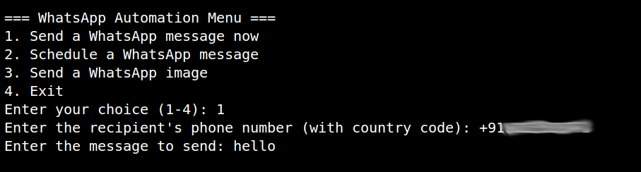
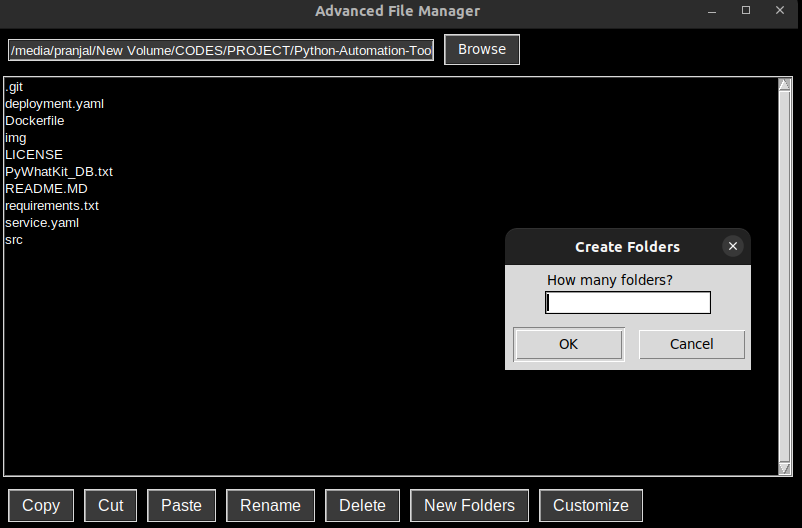
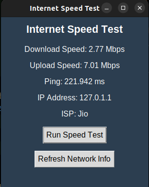
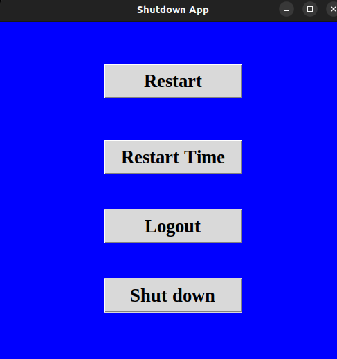

# 🚀 Python Automation Tools  

A collection of Python scripts for automation, file management, and networking tools. These tools help streamline tasks such as messaging, file handling, network monitoring, and system management. 

## 📌 Features  
✔ **Automate WhatsApp Messages** – Send scheduled WhatsApp messages using Python.  
✔ **File Manager** – Advanced file operations including copying, moving, and deleting files.  
✔ **Internet Speed Testing** – Check your internet speed using `speedtest-cli`.  
✔ **Website Blocker** – Block access to specific websites on your system.  
✔ **System Shutdown Automation** – Schedule automatic system shutdowns.  

## 📷 Screenshots  
Here are some visuals showcasing the tools in action:  

### 1️⃣ WhatsApp Automation  
  

### 2️⃣ File Manager  
  

### 3️⃣ Internet Speed Test  


### 4️⃣ Shutdown Scheduler  
  

---

## 🛠 Installation  

### 📥 Clone the Repository  
```sh
git clone https://github.com/YOUR_USERNAME/Python-Automation-Tools.git
cd Python-Automation-Tools
```

### 📦 Install Dependencies  
Make sure you have Python installed, then run:  
```sh
pip install -r requirements.txt
```

---

## 📜 Project Structure  
```
📂 Python-Automation-Tools
│-- 📄 automate_whatsapp_message.py    # WhatsApp automation script
│-- 📄 File_manager.py                 # File management utilities
│-- 📄 inter_net_speed.py              # Internet speed testing
│-- 📄 Shutdown.py                      # System shutdown automation
│-- 📄 website_bloacker.py              # Website blocking script
│-- 📄 PyWhatKit_DB.txt                 # Database for WhatsApp automation
│-- 📄 requirements.txt                  # Dependencies list
│-- 📄 README.md                         # Documentation
```

---

## 🎯 Usage  
Each script can be run independently. Example:  
```sh
python automate_whatsapp_message.py
```

For scheduled shutdowns:  
```sh
python Shutdown.py --time 60  # Shutdown in 60 seconds
```

---

## 🤝 Contributing  
Contributions are welcome! Feel free to fork this repo, create a new branch, and submit a pull request.  

---

## 📜 License  
This project is licensed under the MIT License. See `LICENSE` for details.  
